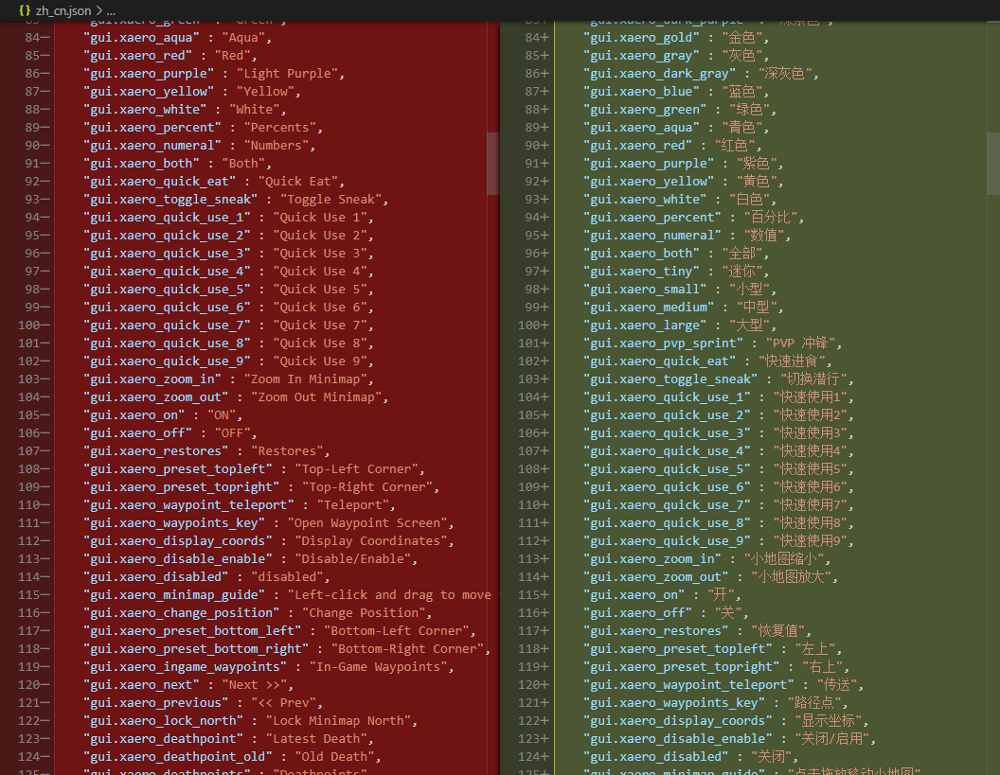
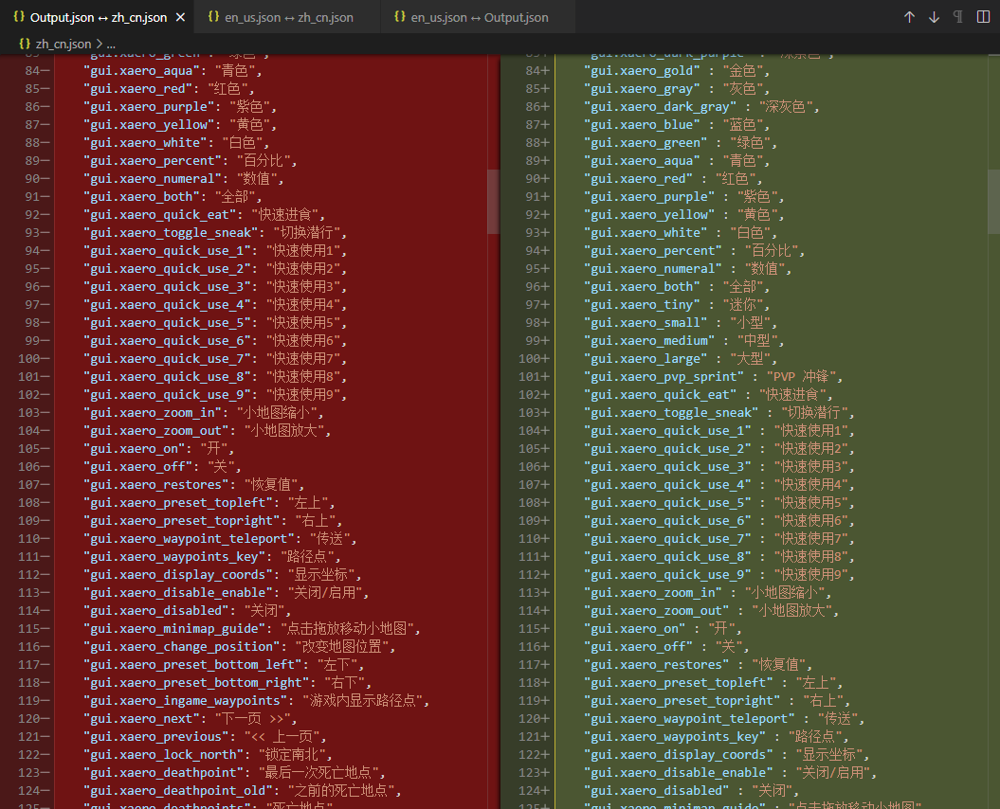
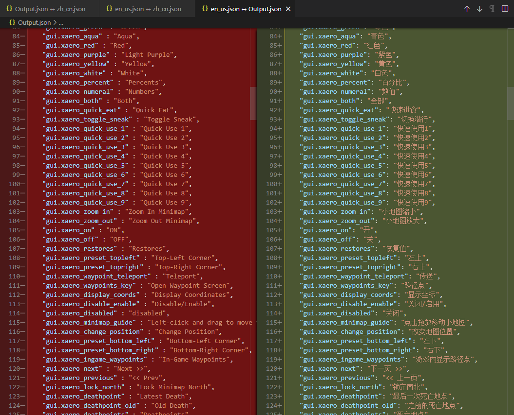
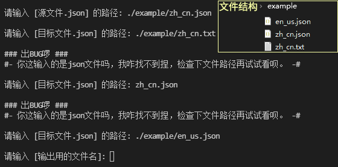
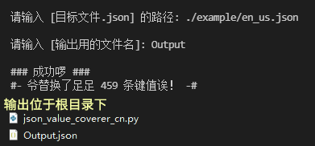

## JSON键值覆盖器 ~~（自动抄值脚本）~~

​    用于把 source.json 的值覆盖到 target.json 的同名键上，非同名键所对应的值不进行操作。

​    人话翻译：这脚本帮你把source.json里面的键值对，拿去target.json里面搜一下看看能不能找到同名的键名，找到了就把source.json的键值写入target.json的同名键名下。

## 为什么要写这个脚本？

对于一些作者不承认or不同步更新汉化语言文件的作者来说，更新翻译是一个痛苦的事情，需要把当前最新版本的英文语言文件拔出来，找出新增了哪些，然后Ctrl+CV。

**但是，有些作者不光新增，他还删减！**

因为删减key的行为，没办法使用代码行数对比来确认新增内容范围；其次也会使这种条件下更新出来的语言文件成为一个独立的，船新的大杂烩版本（简称屎山）；而且最担心的是作者在以前的key中偷偷赛一个新增，这又不得不去把之前的所有key分批检查一遍。这使得光是拿到一份最新版本继承了以往汉化的文件就需要至少半小时。

**那这个操作不能用文件对比完成吗？**

正是因为文件对比时，键值也会参与比较，导致有对比和无对比没有差别，所以才写了这个脚本，以自动化的将已汉化的内容抄到最新的语言文件中，利用键名校验保证绝不多抄任何一行无用汉化，将准备工作消耗的时间从半小时节约至十几秒。

##### 我们先来欣赏一波语言文件大赏：

可以看到，新版本的英文语言文件已经与已汉化的文件无法对其，作者他删减过以前的键名

输出文件键值完全继承自汉化文件

并且输出文件与新版英文的行数可以完全对齐，键名与新版语言文件完全一致

## 用法:

##### Windows:

​    有装Python的可以直接run，没python环境的或者懒狗（比如我）需要去release里面挑一个打包好的exe程序来使用

##### Linux:

​    系统都日用Linux了肯定会用python吧！不会随便找个教程装个python3然后python3 json_value_coverer.py就可以run了

## 运行截图：

输入时会校验文件，只允许json文件输入

指定输出文件名时无需输入后缀，输出位置为程序同目录下

